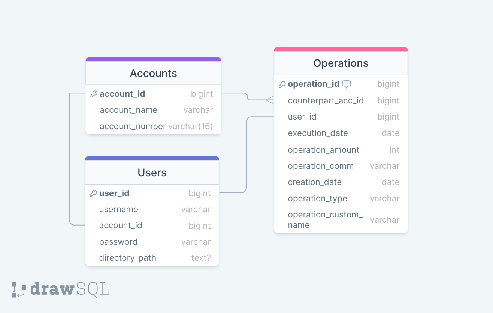

# Representation

# Tables

## Operations

This table contains every operations that is handled by the CSV processing.

| Column | Explanation |
|----------|--------------|
| operation_id | Id of the operation |
| counterpart_acc_id | The account that receives the transaction |
| user_id| The user |
| execution_date | The date of execution of the operaiton |
| operation_amount | The amount of the operation |
| operation_comm | The communication specified in the operation |
| creation_date | The date of creation of the entry |
| operation_custom_name | Name choosed by the user for a specific operation|
| operation_type | The type of operation performed (Withdraw, payment, ...) |

## Accounts

This table contains every accounts.

| Column | Explanation |
|----------|--------------|
| account_id | Id of the account |
| account_name | Name of the account |
| account_number | Account number |

## Users

This table contains every users.

| Column | Explanation |
|----------|--------------|
| user_id | Id of the user |
| username | Custom username defined by the user |
| account_id | FK linked to the account of the user |
| password | Encrypted password of the user |
| directory_path | Path to the directory containing the user's files |